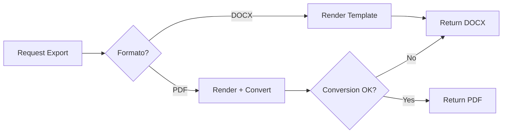
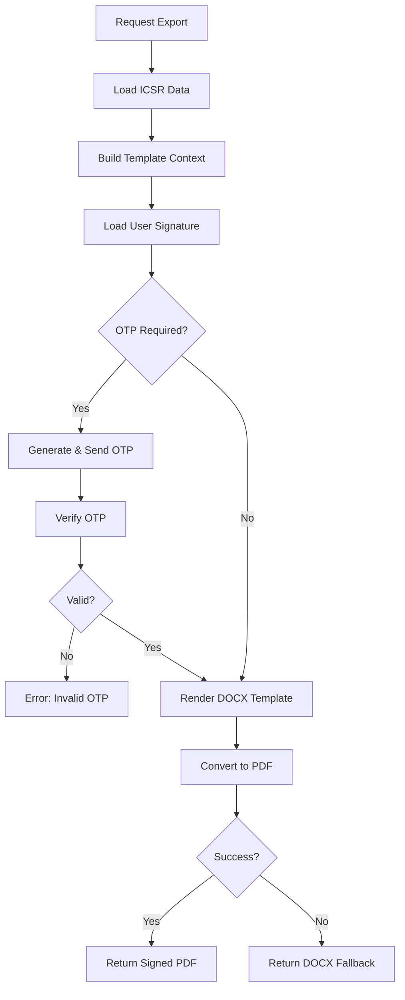

## Introduction

The Export API provides functionality to generate pharmacovigilance documents and ICSR (Individual Case Safety Report) exports in various formats. All exports include digital signatures from the authenticated user and support both official regulatory submissions and internal documentation.

## Base URL

```
/api/v1/icsr
```

## Authentication

All export endpoints require authentication with appropriate role permissions.

**Allowed Roles:**
- `admin`
- `qf` (Químico Farmacéutico)
- `responsable_fv` (Farmacovigilancia Manager)
- `qa` (Quality Assurance)
- `direccion_tecnica` (Technical Director)
- `legal`
- `soporte` (Support)

```bash
Authorization: Bearer <your_token>
```

---

## Export Modelo B (DOCX)

Export the "Formato Profesionales Salud" template for an ICSR case as a fully populated DOCX file.

<CodeGroup>
```bash GET /api/v1/icsr/{icsr_id}/export/modelo-b.docx
curl -X GET https://api.vigia.com/api/v1/icsr/123/export/modelo-b.docx \
  -H "Authorization: Bearer YOUR_TOKEN" \
  -o ICSR_123_Formato.docx
```

```python Python
import requests

url = "https://api.vigia.com/api/v1/icsr/123/export/modelo-b.docx"
headers = {"Authorization": f"Bearer {token}"}

response = requests.get(url, headers=headers)
with open("ICSR_123_Formato.docx", "wb") as f:
    f.write(response.content)
    
print("DOCX exported successfully")
```
</CodeGroup>

### Path Parameters

<ParamField path="icsr_id" type="integer" required>
  ICSR case ID to export
</ParamField>

### Response

Returns a fully populated DOCX file with:
- Patient information (initials, age, sex)
- Suspected product details and registry number
- Adverse event description and timeline
- Medical history and concomitant medications
- Reporter information
- DIGEMID regulatory format fields

### Use Cases

- Review template before PDF conversion
- Manual editing of specific fields
- Archive in editable format
- Internal documentation

---

## Export Modelo B (PDF)

Generate PDF version of the "Formato Profesionales Salud" template with digital signature.

<CodeGroup>
```bash GET /api/v1/icsr/{icsr_id}/export/modelo-b.pdf
curl -X GET https://api.vigia.com/api/v1/icsr/123/export/modelo-b.pdf \
  -H "Authorization: Bearer YOUR_TOKEN" \
  -o ICSR_123_Formato.pdf
```

```python Python
import requests

url = "https://api.vigia.com/api/v1/icsr/123/export/modelo-b.pdf"
headers = {"Authorization": f"Bearer {token}"}

response = requests.get(url, headers=headers)
with open("ICSR_123_Formato.pdf", "wb") as f:
    f.write(response.content)
    
print("PDF exported successfully")
```
</CodeGroup>

### Path Parameters

<ParamField path="icsr_id" type="integer" required>
  ICSR case ID to export
</ParamField>

### Response

Returns a PDF file with:
- Complete ICSR data from the DOCX template
- Embedded digital signature from authenticated user
- Company logo (if configured)
- Signer's contact information

### PDF Conversion Methods

The system attempts conversion using:

1. **docx2pdf** (Windows with MS Word)
2. **LibreOffice** (cross-platform fallback)

If conversion fails, returns the DOCX file as fallback.

### Storage

Generated PDFs are stored in:
```
storage/icsr_exports/ICSR_{icsr_id}_Formato-Profesionales-Salud.pdf
```

---

## Export Official DIGEMID Report

Generate the official DIGEMID regulatory submission PDF with OTP verification support.

<CodeGroup>
```bash GET /api/v1/icsr/{icsr_id}/export/digemid
curl -X GET "https://api.vigia.com/api/v1/icsr/123/export/digemid?formato=pdf" \
  -H "Authorization: Bearer YOUR_TOKEN" \
  -o ICSR_123_DIGEMID_Oficial.pdf
```

```python Python
import requests

url = "https://api.vigia.com/api/v1/icsr/123/export/digemid"
headers = {"Authorization": f"Bearer {token}"}
params = {"formato": "pdf"}

response = requests.get(url, headers=headers, params=params)
with open("ICSR_123_DIGEMID_Oficial.pdf", "wb") as f:
    f.write(response.content)
    
print(f"Status: {response.status_code}")
print(f"Content-Type: {response.headers.get('Content-Type')}")
```
</CodeGroup>

### Path Parameters

<ParamField path="icsr_id" type="integer" required>
  ICSR case ID to export for DIGEMID submission
</ParamField>

### Query Parameters

<ParamField query="formato" type="string" default="pdf">
  Export format. Currently only `"pdf"` is supported.
</ParamField>

### Response

Returns official DIGEMID submission PDF with:
- Complete regulatory-compliant ICSR data
- Digital signature with verification
- Timestamp of generation
- Signer's credentials and contact info
- Company branding (logo, letterhead)

### Signature Context

The export includes signature data from the authenticated user:

```json
{
  "firma_nombre": "Dr. Juan Pérez Ramírez",
  "firma_cargo": "Químico Farmacéutico - Responsable de Farmacovigilancia",
  "firma_company": "OTARVASQ S.A.C.",
  "firma_celular": "+51-987-654-321",
  "firma_email_alt": "juan.perez@otarvasq.com",
  "firma_website": "https://www.otarvasq.com",
  "firma_img_path": "/full/path/to/signature.png",
  "firma_logo_path": "/full/path/to/logo.png"
}
```

### Storage

Generated reports are stored in:
```
storage/icsr_exports/ICSR_{icsr_id}_DIGEMID-Oficial.pdf
```

### Error Handling

If PDF generation fails:
- System returns fully populated DOCX as fallback
- HTTP 500 error if both PDF and DOCX generation fail
- Detailed error logged for debugging

---

## Preview ICSR (Lightweight PDF)

Generate a quick preview PDF without using the full template (for rapid review).

<CodeGroup>
```bash GET /api/v1/icsr/{icsr_id}/preview/pdf
curl -X GET "https://api.vigia.com/api/v1/icsr/123/preview/pdf?source=light" \
  -H "Authorization: Bearer YOUR_TOKEN" \
  -o preview.pdf
```

```python Python
import requests

url = "https://api.vigia.com/api/v1/icsr/123/preview/pdf"
headers = {"Authorization": f"Bearer {token}"}
params = {"source": "light"}

response = requests.get(url, headers=headers, params=params)
with open("preview.pdf", "wb") as f:
    f.write(response.content)
```
</CodeGroup>

### Path Parameters

<ParamField path="icsr_id" type="integer" required>
  ICSR case ID to preview
</ParamField>

### Query Parameters

<ParamField query="source" type="string" default="official">
  Preview source:
  - `"official"`: Use official template (slower)
  - `"light"`: Generate quick text-based preview (faster)
</ParamField>

### Response

Returns a lightweight PDF with:
- ICSR case number
- Patient initials, age, and sex
- Suspected product name
- Event start date
- Brief adverse event description

Generated in-memory using ReportLab for speed.

### Response Headers

```
Content-Disposition: inline; filename="ICSR_000123_preview.pdf"
X-Generated-At: 2026-03-03T15:30:00Z
```

### Use Cases

- Quick case review without full export
- Testing data completeness
- Internal team discussions
- Pre-submission validation

---

## Export Context (Debug)

Retrieve the complete data context used for template rendering (for debugging).

<CodeGroup>
```bash GET /api/v1/icsr/{icsr_id}/export/context
curl -X GET https://api.vigia.com/api/v1/icsr/123/export/context \
  -H "Authorization: Bearer YOUR_TOKEN"
```

```python Python
import requests
import json

url = "https://api.vigia.com/api/v1/icsr/123/export/context"
headers = {"Authorization": f"Bearer {token}"}

response = requests.get(url, headers=headers)
context = response.json()

print(json.dumps(context, indent=2))
```
</CodeGroup>

### Path Parameters

<ParamField path="icsr_id" type="integer" required>
  ICSR case ID
</ParamField>

### Response

Returns JSON object with complete template context:

```json
{
  "paciente_iniciales": "J.D.",
  "paciente_edad": "45",
  "paciente_sexo": "M",
  "producto_sospechoso": "Paracetamol 500mg",
  "registro_sanitario": "RS-12345",
  "fecha_inicio_evento": "2026-02-15",
  "descripcion_evento": "Paciente presenta urticaria generalizada...",
  "gravedad": "Moderado",
  "desenlace": "Recuperado",
  "firma_nombre": "Dr. Juan Pérez Ramírez",
  "firma_cargo": "Químico Farmacéutico",
  "firma_company": "OTARVASQ S.A.C.",
  "firma_celular": "+51-987-654-321",
  "firma_email_alt": "juan.perez@otarvasq.com",
  "firma_website": "https://www.otarvasq.com",
  "reportero_nombre": "Dra. María García",
  "reportero_profesion": "Médico",
  "fecha_reporte": "2026-02-20"
}
```

### Use Cases

- Debug template rendering issues
- Verify data mapping correctness
- Test signature integration
- Validate required fields
- API integration testing

---

## Export Workflow

### Standard Export Process



### DIGEMID Official Export (with OTP)



---

## File Format Specifications

### DOCX (Microsoft Word)

**Template Engine**: docxtpl (python-docx-template)

**Features**:
- Jinja2-style placeholders: `{{ variable_name }}`
- Conditional sections
- Table rows iteration
- Image embedding

**Template Location**:
```
app/templates/docs/Formato Profesionales Salud.docx
```

**MIME Type**: 
```
application/vnd.openxmlformats-officedocument.wordprocessingml.document
```

### PDF (Portable Document Format)

**Conversion Tools**:
1. **docx2pdf**: Windows-only, requires MS Word installed
2. **LibreOffice**: Cross-platform, uses `soffice --headless --convert-to pdf`

**Features**:
- Preserves document formatting
- Embeds signature images
- Includes company branding
- Non-editable final format

**MIME Type**:
```
application/pdf
```

### Preview PDF (Lightweight)

**Generation Tool**: ReportLab

**Features**:
- Fast in-memory generation
- Basic text layout
- No template processing
- Minimal file size

---

## Signature Integration

All exports automatically include the digital signature from the authenticated user's profile.

### Signature Resolution Process

1. **Retrieve Employee ID**: Extract from authenticated user token
2. **Load Firma Record**: Query `rrhh_firma` table by `empleado_id`
3. **Resolve Image Paths**: Convert relative URLs to absolute file paths
4. **Build Context**: Add signature fields to template context
5. **Embed in Document**: Render signature image and metadata

### Path Resolution

The system attempts to resolve signature images using:

```python
Candidates:
1. Absolute path (if exists)
2. backend_root / raw_path
3. backend_root / storage / firmas / filename
```

Example:
```
/uploads/firmas_42/firma.png
→ /home/vigia/backend/storage/firmas/firma.png
```

### Signature Fields in Template

| Template Variable | Source Field |
|-------------------|-------------|
| `{{ firma_nombre }}` | `firma.nombre` |
| `{{ firma_cargo }}` | `firma.cargo` |
| `{{ firma_company }}` | `firma.company` |
| `{{ firma_celular }}` | `firma.celular` or `firma.telefono` |
| `{{ firma_email_alt }}` | `firma.email_alt` |
| `{{ firma_website }}` | `firma.website` |
| Image placeholder | Resolved from `firma.firma_img_url` |
| Logo placeholder | Resolved from `firma.logo_url` |

---

## Error Codes

| Status Code | Description | Solution |
|-------------|-------------|----------|
| 200 | Success | Export completed successfully |
| 400 | Bad Request | Invalid ICSR ID or unsupported format |
| 404 | Not Found | ICSR case does not exist |
| 500 | Internal Server Error | PDF conversion failed, check logs |

### Common Error Messages

**"ICSR {id} no encontrado"**
- ICSR case ID does not exist in database
- Verify case ID is correct

**"Formato no soportado por ahora (solo pdf)"**
- Requested format is not implemented
- Use `formato=pdf` parameter

**"No se pudo generar ni PDF ni DOCX"**
- Template rendering failed
- Check ICSR data completeness
- Verify template file exists

**"PDF vacío"**
- PDF conversion produced empty file
- Check LibreOffice/Word installation
- Review conversion logs

---

## Best Practices

### 1. Verify Data Completeness

Before exporting, ensure all required ICSR fields are populated:

```python
# Check context data
response = requests.get(f"{base_url}/icsr/123/export/context", headers=headers)
context = response.json()

required_fields = ['paciente_iniciales', 'producto_sospechoso', 'fecha_inicio_evento']
missing = [f for f in required_fields if not context.get(f)]

if missing:
    print(f"Missing required fields: {missing}")
else:
    print("All required fields present, proceeding with export")
```

### 2. Use Preview for Quick Review

Use lightweight preview for rapid iteration:

```python
# Quick preview
preview_response = requests.get(f"{base_url}/icsr/123/preview/pdf", headers=headers)

# Only generate full export when ready
if preview_looks_good():
    export_response = requests.get(f"{base_url}/icsr/123/export/digemid", headers=headers)
```

### 3. Handle Conversion Failures

Always check response Content-Type:

```python
response = requests.get(f"{base_url}/icsr/123/export/modelo-b.pdf", headers=headers)

if response.headers['Content-Type'] == 'application/pdf':
    print("PDF generated successfully")
elif 'wordprocessingml' in response.headers['Content-Type']:
    print("PDF conversion failed, received DOCX fallback")
```

### 4. Configure Signature Profile First

Ensure signature is configured before exporting:

```python
# 1. Setup signature
firma_response = requests.get(f"{base_url}/firmas/me", headers=headers)
firma = firma_response.json()

if not firma.get('firma_img_url'):
    print("Warning: No signature image configured")
    # Upload signature before proceeding

# 2. Then export
export_response = requests.get(f"{base_url}/icsr/123/export/digemid", headers=headers)
```

### 5. Store Exports with Metadata

```python
import datetime

response = requests.get(f"{base_url}/icsr/123/export/digemid", headers=headers)

if response.ok:
    timestamp = datetime.datetime.now().strftime("%Y%m%d_%H%M%S")
    filename = f"ICSR_123_DIGEMID_{timestamp}.pdf"
    
    with open(filename, 'wb') as f:
        f.write(response.content)
    
    # Store metadata
    metadata = {
        'icsr_id': 123,
        'export_date': timestamp,
        'exported_by': user_email,
        'file_size': len(response.content),
        'filename': filename
    }
```

---

## Complete Export Example

```python Python
import requests
import json

class ICSRExporter:
    def __init__(self, base_url, token):
        self.base_url = base_url
        self.headers = {"Authorization": f"Bearer {token}"}
    
    def verify_signature(self):
        """Ensure signature is configured"""
        response = requests.get(
            f"{self.base_url}/firmas/me",
            headers=self.headers
        )
        firma = response.json()
        
        if not firma.get('firma_img_url'):
            raise ValueError("Signature not configured. Please upload signature image.")
        
        return firma
    
    def check_data_completeness(self, icsr_id):
        """Verify ICSR data is complete"""
        response = requests.get(
            f"{self.base_url}/icsr/{icsr_id}/export/context",
            headers=self.headers
        )
        context = response.json()
        
        required = ['paciente_iniciales', 'producto_sospechoso', 'fecha_inicio_evento']
        missing = [f for f in required if not context.get(f)]
        
        if missing:
            raise ValueError(f"Missing required fields: {missing}")
        
        return context
    
    def preview(self, icsr_id):
        """Generate quick preview"""
        response = requests.get(
            f"{self.base_url}/icsr/{icsr_id}/preview/pdf",
            headers=self.headers,
            params={"source": "light"}
        )
        
        if response.ok:
            with open(f"preview_{icsr_id}.pdf", "wb") as f:
                f.write(response.content)
            return True
        return False
    
    def export_docx(self, icsr_id):
        """Export editable DOCX"""
        response = requests.get(
            f"{self.base_url}/icsr/{icsr_id}/export/modelo-b.docx",
            headers=self.headers
        )
        
        if response.ok:
            filename = f"ICSR_{icsr_id}_Formato.docx"
            with open(filename, "wb") as f:
                f.write(response.content)
            print(f"DOCX exported: {filename}")
            return filename
        else:
            raise Exception(f"Export failed: {response.status_code}")
    
    def export_official_pdf(self, icsr_id):
        """Export official DIGEMID PDF"""
        response = requests.get(
            f"{self.base_url}/icsr/{icsr_id}/export/digemid",
            headers=self.headers,
            params={"formato": "pdf"}
        )
        
        if response.ok:
            # Check if we got PDF or DOCX fallback
            content_type = response.headers.get('Content-Type', '')
            
            if 'pdf' in content_type:
                filename = f"ICSR_{icsr_id}_DIGEMID_Oficial.pdf"
                print("PDF generated successfully")
            else:
                filename = f"ICSR_{icsr_id}_DIGEMID_Oficial.docx"
                print("PDF conversion failed, saved as DOCX")
            
            with open(filename, "wb") as f:
                f.write(response.content)
            
            return filename
        else:
            raise Exception(f"Export failed: {response.status_code}")
    
    def full_export_workflow(self, icsr_id):
        """Complete export workflow with validation"""
        print(f"Starting export for ICSR {icsr_id}...")
        
        # 1. Verify signature
        print("1. Verifying signature configuration...")
        firma = self.verify_signature()
        print(f"   ✓ Signature configured for {firma['nombre']}")
        
        # 2. Check data completeness
        print("2. Checking data completeness...")
        context = self.check_data_completeness(icsr_id)
        print(f"   ✓ All required fields present")
        
        # 3. Generate preview
        print("3. Generating preview...")
        if self.preview(icsr_id):
            print(f"   ✓ Preview saved as preview_{icsr_id}.pdf")
        
        # 4. Export DOCX
        print("4. Exporting DOCX...")
        docx_file = self.export_docx(icsr_id)
        print(f"   ✓ {docx_file}")
        
        # 5. Export official PDF
        print("5. Exporting official DIGEMID PDF...")
        pdf_file = self.export_official_pdf(icsr_id)
        print(f"   ✓ {pdf_file}")
        
        print("\n✓ Export workflow completed successfully!")
        return {
            'preview': f"preview_{icsr_id}.pdf",
            'docx': docx_file,
            'pdf': pdf_file
        }

# Usage
exporter = ICSRExporter(
    base_url="https://api.vigia.com/api/v1",
    token="your_token_here"
)

try:
    files = exporter.full_export_workflow(icsr_id=123)
    print(f"\nGenerated files: {json.dumps(files, indent=2)}")
except Exception as e:
    print(f"Error: {e}")
```

---

## Related Documentation

<CardGroup cols={2}>
  <Card title="Document Upload" icon="upload" href="/api/documents/upload">
    Create and upload documents
  </Card>
  <Card title="Digital Signatures" icon="signature" href="/api/documents/signatures">
    Configure signature profiles
  </Card>
  <Card title="Overview" icon="folder-open" href="/api/documents/overview">
    Document management overview
  </Card>
</CardGroup>
