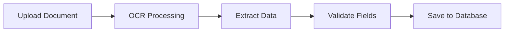

## Overview

This endpoint uses Natural Language Processing (NLP) and intelligent pattern matching to extract structured data fields from unstructured adverse event reports. It's specifically designed for pharmacovigilance use cases and can identify patient information, adverse events, suspected products, and reporter details.

## Use Cases

- Parse OCR-extracted text from paper adverse event reports
- Extract structured data from email reports
- Process narrative text from healthcare providers
- Automate data entry for pharmacovigilance databases

## Request

<ParamField body="text" type="string" required>
  The unstructured text to analyze. This is typically the output from the OCR endpoint or any narrative adverse event description.
</ParamField>

### Example Request

```bash
curl -X POST https://api.vigia.com/api/v1/nlp/extract \
  -H "Authorization: Bearer YOUR_API_KEY" \
  -H "Content-Type: application/json" \
  -d '{
    "text": "Iniciales: C.R. Edad: 45 años. Sexo: Masculino. Peso: 72 kg. Producto sospechoso: Ibuprofeno 400 mg. Fecha: 2025-08-10. Presentó urticaria generalizada. Reporta: Dra. María González"
  }'
```

```python
import requests

url = "https://api.vigia.com/api/v1/nlp/extract"
headers = {
    "Authorization": "Bearer YOUR_API_KEY",
    "Content-Type": "application/json"
}

payload = {
    "text": """Iniciales del paciente: J.D.
    Edad: 28 años
    Sexo: Femenino
    Peso corporal: 65.5 kg
    
    Producto sospechoso: Amoxicilina 500 mg
    Fecha de inicio: 10/08/2025
    
    Evento adverso: La paciente presentó rash cutáneo y prurito intenso tras
    uso de Amoxicilina durante 3 días.
    
    Reportado por: Dr. Carlos Méndez
    """
}

response = requests.post(url, json=payload, headers=headers)
print(response.json())
```

## Response

The response contains extracted fields as a JSON object. Only fields that are successfully identified in the text are included.

<ResponseField name="paciente_iniciales" type="string">
  Patient initials (1-3 characters). Examples: "CR", "J.D.", "ABC"
</ResponseField>

<ResponseField name="edad" type="integer">
  Patient age in years (between 0 and 120)
</ResponseField>

<ResponseField name="sexo" type="string">
  Patient sex. Values: `"M"` (Male) or `"F"` (Female)
</ResponseField>

<ResponseField name="peso" type="number">
  Patient weight in kilograms (decimal values supported)
</ResponseField>

<ResponseField name="producto_sospechoso" type="string">
  The suspected medication or product, including dosage if mentioned
</ResponseField>

<ResponseField name="fecha_inicio" type="string">
  Date of event onset in ISO format (YYYY-MM-DD) or as found in text
</ResponseField>

<ResponseField name="evento_adverso" type="string">
  Description of the adverse event or reaction
</ResponseField>

<ResponseField name="reportante_nombre" type="string">
  Name of the person reporting the adverse event
</ResponseField>

### Example Response

```json
{
  "paciente_iniciales": "JD",
  "edad": 28,
  "sexo": "F",
  "peso": 65.5,
  "producto_sospechoso": "Amoxicilina 500 mg",
  "fecha_inicio": "2025-08-10",
  "evento_adverso": "rash cutáneo y prurito intenso tras uso de Amoxicilina durante 3 días.",
  "reportante_nombre": "Dr. Carlos Méndez"
}
```

## Extraction Patterns

### Patient Initials

Recognizes multiple formats:
- Explicit labels: "Iniciales: C.R.", "Iniciales del paciente: AB"
- Standalone patterns: "J.D.", "CR"
- Derived from names: "Paciente: Juan David" → "J.D."

### Age

Supports various age expressions:
- "45 años", "45 año", "45 a.o.s"
- "de 45 años"
- "45 yo" (years old)

Valid range: 0-120 years

### Sex

Recognizes Spanish gender terms:
- **Male**: "Masculino", "Hombre", "Sexo: M"
- **Female**: "Femenino", "Mujer", "Sexo: F"

### Weight

Extracts weight in kilograms:
- "Peso: 72 kg", "Peso corporal 72.5kg"
- "PESO 72,5 KG" (handles comma as decimal separator)
- Supports decimal values

### Suspected Product

Identifies medications through:
- Explicit labels: "Producto sospechoso: Ibuprofeno 400 mg"
- Contextual phrases: "uso de", "administración de", "ingestión de", "tomó", "recibió"
- Includes dosage and units (mg, g, mcg, ml, UI, U)

Example patterns:
- "tras uso de Ibuprofeno 400 mg"
- "administración de Paracetamol"
- "tomó Amoxicilina 500 mg"

### Event Date

Supports multiple date formats:
- ISO format: "2025-08-10"
- Spanish format: "10/08/2025", "10-08-2025"
- Context: "Fecha: 10/08/2025", "el día 10/08/2025"

Dates are normalized to ISO format (YYYY-MM-DD) when possible.

### Adverse Event

Detects adverse reactions through:
- Action verbs: "presentó urticaria", "desarrolló rash"
- Explicit labels: "Evento adverso: ..."
- Common terms: anafilaxia, urticaria, rash, exantema, erupción, prurito, angioedema

### Reporter

Identifies reporter through:
- "Reporta: Dra. X", "Reportante: Juan Pérez"
- "Reportado por: ...", "Quien reporta: ..."
- Extracts full name including titles (Dr., Dra.)

## Regular Expression Patterns

The service uses sophisticated regex patterns:

- **Units**: `(?:mg|mcg|g|kg|ml|mL|UI|U)`
- **Dates**: `(?:\d{4}-\d{2}-\d{2}|\d{2}[/-]\d{2}[/-]\d{4})`
- Case-insensitive matching for Spanish text
- Handles accented characters (á, é, í, ó, ú, ñ)

## Data Quality

### High Confidence Fields

These fields have high extraction accuracy:
- Patient initials (when explicitly labeled)
- Age (when using standard Spanish format)
- Sex (when using medical terminology)
- Weight (when labeled with "peso")

### Context-Dependent Fields

These fields require good narrative structure:
- Suspected product (depends on verb usage)
- Adverse event (depends on medical terminology)
- Reporter name (depends on formal reporting structure)

## Best Practices

1. **Structured Text**: Better results with semi-structured reports that use labels
2. **Spanish Language**: Optimized for Spanish medical terminology
3. **Complete Sentences**: Narrative descriptions improve event extraction
4. **Standard Formats**: Use medical abbreviations (kg, mg, años)
5. **Verify Results**: Always validate extracted data, especially dates and dosages

## Limitations

- Designed primarily for Spanish-language text
- Works best with medical/pharmacovigilance terminology
- Date conversion may fail for ambiguous formats
- Complex narratives may result in partial extraction
- Does not validate medical accuracy of extracted terms

## Integration Workflow



1. Upload document to `/api/v1/ocr/preview`
2. Pass OCR text to `/api/v1/nlp/extract`
3. Validate and review extracted fields
4. Store in pharmacovigilance database

## Next Steps

- Review [OCR Processing](/api/ocr/process-document) to extract text from documents first
- Use [Translation](/api/nlp/translate) if you need to translate non-Spanish reports
- Validate extracted data against your database constraints
