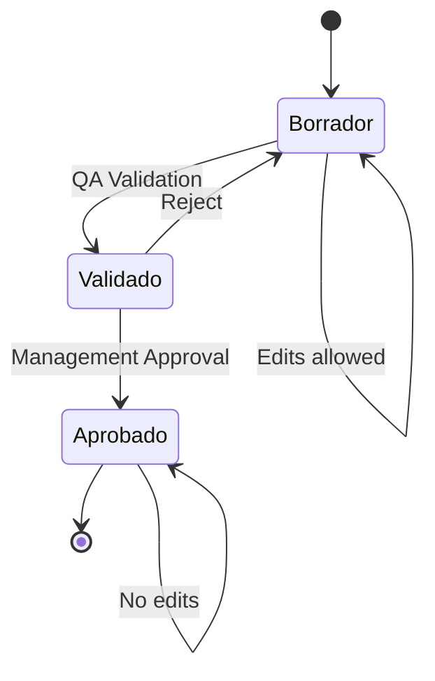

## Overview

The IPS (Informe Periódico de Seguridad) module, also known as PSUR (Periodic Safety Update Report), automates the creation of periodic safety reports required by regulatory authorities worldwide.

<CardGroup cols={2}>
  <Card title="Automated Literature Search" icon="magnifying-glass">
    Search PubMed, LILACS, and SciELO for safety literature
  </Card>
  <Card title="Case Aggregation" icon="chart-column">
    Automatically count and aggregate ICSR cases by period
  </Card>
  <Card title="Workflow States" icon="diagram-next">
    Borrador → Validado → Aprobado with QA checkpoints
  </Card>
  <Card title="Multi-Format Export" icon="file-export">
    Generate DOCX, PDF, and HTML reports
  </Card>
</CardGroup>

## IPS Report Structure

### Product Information

Each IPS report is linked to a specific pharmaceutical product:

```python
# Product data model (backend/app/models/ips.py:17-39)
class IPSProducto:
    - nombre: Product name and presentation
    - principio_activo: Active ingredient (IFA)
    - forma_farmaceutica: Pharmaceutical form (tablets, capsules, etc.)
    - presentacion: Package presentation
    - via: Administration route
    - registro_sanitario: Registration number
    - fecha_autorizacion: Authorization date
    - fabricante: Manufacturer
```

### Report Metadata

```python
class IPSReport:
    - producto_id: Link to IPSProducto
    - periodo_inicio: Report period start date
    - periodo_fin: Report period end date
    - version: Report version number
    - estado: Workflow state (borrador/validado/aprobado)
    
    # Metrics
    - unidades_comercializadas: Units sold in period
    - lotes_distribuidos: Batches distributed
    
    # Report sections (JSONB fields)
    - eventos_resumen: Summary of adverse events
    - senales_detectadas: Detected safety signals
    - acciones_regulatorias: Regulatory actions taken
    - evaluacion_benef_riesgo: Benefit-risk assessment
    - conclusiones: Conclusions and recommendations
```

## Creating an IPS Report

### From Calendar

VIGIA integrates with a product calendar (`calendario_ips`) to streamline IPS creation:

<Steps>
  <Step title="Search for product in calendar">
    ```bash
    GET /api/v1/ips/calendario-search?q=paracetamol&limit=20
    ```
    
    Returns products with their registration numbers and IPS due dates:
    ```json
    [
      {
        "id": 123,
        "label": "PARACETAMOL 500 MG TABLETAS · Reg. AB-1234"
      }
    ]
    ```
  </Step>
  
  <Step title="Get prefilled data from calendar">
    ```bash
    GET /api/v1/ips/calendario/{cal_id}/prefill
    ```
    
    Returns pre-populated product and period data:
    ```json
    {
      "producto": {
        "nombre": "PARACETAMOL 500 MG TABLETAS",
        "principio_activo": "Paracetamol",
        "registro_sanitario": "AB-1234",
        "fecha_autorizacion": "2020-01-15"
      },
      "report": {
        "periodo_inicio": "2023-01-01",
        "periodo_fin": "2023-06-30",
        "estado": "borrador"
      },
      "cal_id": 123
    }
    ```
  </Step>
  
  <Step title="Create IPS from calendar">
    ```bash
    POST /api/v1/ips/from-calendario?cal_id=123&periodo_inicio=2024-01-01&periodo_fin=2024-06-30
    ```
    
    Automatically:
    - Creates or reuses IPSProducto
    - Creates IPSReport with correct dates
    - Links to calendar entry for tracking
  </Step>
</Steps>

### Manual Creation

For products not in the calendar:

```bash
POST /api/v1/ips
Content-Type: application/json

{
  "producto_id": 45,
  "periodo_inicio": "2024-01-01",
  "periodo_fin": "2024-06-30",
  "version": 1,
  "estado": "borrador",
  "unidades_comercializadas": 150000
}
```

<Note>
**Automatic case counting**: When an IPS is created or viewed, VIGIA automatically counts related ICSR cases within the reporting period based on product matching.
</Note>

## Literature Search Integration

### Supported Sources

VIGIA searches multiple biomedical databases:

| Source | Description | Coverage |
|--------|-------------|----------|
| **PubMed Central (PMC)** | NIH's free full-text archive | Global, English |
| **LILACS** | Latin American health sciences | Latin America, Spanish/Portuguese |
| **SciELO** | Scientific Electronic Library Online | Ibero-America, multi-language |

### Save Literature Results

```bash
POST /api/v1/ips/{report_id}/fuentes/bulk
Content-Type: application/json

{
  "translate": true,
  "target_lang": "es",
  "items": [
    {
      "source": "PMC",
      "title": "Hepatotoxicity associated with paracetamol overdose",
      "citation": "Smith J, et al. (2023). J Hepatol. 78(4):234-241.",
      "url": "https://pubmed.ncbi.nlm.nih.gov/12345678",
      "year": 2023,
      "journal": "Journal of Hepatology",
      "abstract": "This study evaluates...",
      "detected_total": 15
    },
    {
      "source": "LILACS",
      "title": "Reacciones adversas al paracetamol en pacientes pediátricos",
      "year": 2024,
      "journal": "Revista Médica de Chile"
    }
  ]
}
```

**Features:**
- **Auto-translation**: Translate titles/abstracts to target language (ES/EN)
- **Deduplication**: Prevents duplicate entries by URL+title+year
- **Smart upsert**: Updates existing entries with better data
- **Auto KPI calculation**: Updates literature counts by source

**Response:**
```json
{
  "saved": 2,
  "total_now": 47,
  "kpis": {
    "literaturas_detected": 47,
    "pmc_detected": 25,
    "lilacs_detected": 12,
    "scielo_detected": 10
  }
}
```

### Clean Up Literature References

Remove duplicates and normalize citations:

```bash
POST /api/v1/ips/{report_id}/fuentes/cleanup
```

Performs:
- Citation normalization
- Duplicate removal
- Format standardization

## IPS Workflow

### Workflow States



| Estado | Permissions | Actions |
|--------|-------------|----------|
| **Borrador** | `ips:edit` | Create, Edit, Delete |
| **Validado** | `ips:qa` | Cannot edit, can approve/reject |
| **Aprobado** | `ips:approve` | Read-only, can export |

### State Transitions

**QA Validation:**
```bash
POST /api/v1/ips/{report_id}/qa-validate
```
Requires: `ips:qa` permission
Changes: `borrador` → `validado`

**Approval:**
```bash
POST /api/v1/ips/{report_id}/approve
```
Requires: `ips:approve` permission
Changes: `validado` → `aprobado`

<Warning>
**Immutability**: Once approved, IPS reports cannot be edited. Create a new version if changes are needed.
</Warning>

## Case Aggregation

VIGIA automatically aggregates ICSR cases matching the IPS product and period:

```python
# Source: backend/app/services/ips_aggregator.py
def count_cases(db: Session, producto: IPSProducto, inicio: date, fin: date) -> int:
    # Matches by:
    # 1. Product registration number
    # 2. Product name similarity
    # 3. Active ingredient (IFA)
    # Within the reporting period
```

**Matching logic:**
- Exact match on `registro_sanitario`
- Fuzzy match on product name
- IFA (active ingredient) matching
- Event date within `[periodo_inicio, periodo_fin]`

**Case metrics included:**
- Total cases in period
- Cases by severity (Grave, Moderada, Leve)
- Cases by causality (Definitiva, Probable, Posible)
- Cases by outcome (Recuperado, Muerte, etc.)

## Report Generation

### DOCX Export

```bash
GET /api/v1/ips/{ips_id}/export/docx
```

Generates Microsoft Word document using template:
- **Template location**: `app/templates/docs/IPS_TEMPLATE.docx`
- Uses `python-docx-template` for variable replacement
- Includes literature references, case summaries, charts

**Template variables:**
```jinja
{{producto_nombre}}
{{principio_activo}}
{{periodo_inicio}} - {{periodo_fin}}
{{casos_total}}
{{literaturas_detected}}
{{eventos_resumen}}
{{conclusiones}}
```

### PDF Export

```bash
GET /api/v1/ips/{ips_id}/export/pdf
```

Two methods:

1. **Local conversion** (LibreOffice):
   ```bash
   GET /api/v1/ips/{ips_id}/export-local/pdf
   ```
   Requires LibreOffice installed on server

2. **Cloud conversion** (via external service):
   ```bash
   GET /api/v1/ips/{ips_id}/export/pdf
   ```

### HTML Export

```bash
GET /api/v1/ips/{report_id}/export.html
```

Generates standalone HTML report for preview/email.

## API Endpoints Summary

### IPS CRUD

```bash
# List all IPS reports
GET /api/v1/ips?limit=50&offset=0&estado=borrador&producto=123

# Get single report
GET /api/v1/ips/{report_id}

# Create report
POST /api/v1/ips

# Update report (borrador only)
PUT /api/v1/ips/{report_id}

# Delete report (borrador only, requires password)
DELETE /api/v1/ips/{report_id}
```

### Calendar Integration

```bash
# Search calendar
GET /api/v1/ips/calendario-search?q={query}&limit=20

# Get prefill data
GET /api/v1/ips/calendario/{cal_id}/prefill

# Create from calendar
POST /api/v1/ips/from-calendario?cal_id={id}

# Get report history for calendar item
GET /api/v1/ips/calendario/{cal_id}/reports
```

### Literature

```bash
# Get literature sources
GET /api/v1/ips/{report_id}/fuentes

# Save literature (with auto-translate)
POST /api/v1/ips/{report_id}/fuentes/bulk

# Cleanup duplicates
POST /api/v1/ips/{report_id}/fuentes/cleanup
```

### Workflow

```bash
# QA validation
POST /api/v1/ips/{report_id}/qa-validate

# Approval
POST /api/v1/ips/{report_id}/approve

# Regenerate (refresh case counts)
POST /api/v1/ips/{report_id}/regen
```

### Export

```bash
# DOCX export
GET /api/v1/ips/{ips_id}/export/docx

# PDF export (cloud)
GET /api/v1/ips/{ips_id}/export/pdf

# PDF export (local)
GET /api/v1/ips/{ips_id}/export-local/pdf

# HTML export
GET /api/v1/ips/{report_id}/export.html
```

## Code References

| Feature | Implementation |
|---------|---------------|
| IPS Models | `backend/app/models/ips.py:11-89` |
| IPS Router | `backend/app/routers/ips.py` |
| Literature Sources | `backend/app/models/ips_fuente.py` |
| Case Aggregation | `backend/app/services/ips_aggregator.py` |
| DOCX Generation | `backend/app/services/ips_docx.py` |
| Calendar Integration | `backend/app/routers/ips.py:260-748` |

## Best Practices

<CardGroup cols={2}>
  <Card title="Data Quality" icon="chart-line">
    - Verify product matching before creating IPS
    - Review auto-counted cases for accuracy
    - Include all relevant literature sources
    - Document benefit-risk assessment thoroughly
  </Card>
  
  <Card title="Workflow Management" icon="list-check">
    - Complete all sections before QA validation
    - Review literature references for duplicates
    - Use cleanup tools regularly
    - Export to PDF only after approval
  </Card>
</CardGroup>

## Related Features

- [ICSR Management](/features/icsr-management) - Source data for case aggregation
- [Surveillance](/features/surveillance) - Global monitoring for signals
- [Document Management](/features/document-management) - Attach supporting documents
