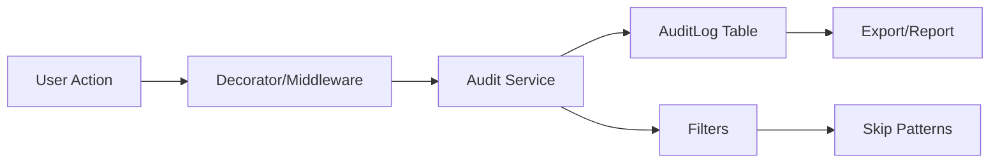

## Overview

The Audit Trail module provides complete system activity tracking for regulatory compliance (21 CFR Part 11, EU Annex 11, ICH E6 R2), with automatic logging of all data changes, user actions, and system events.

## Architecture

<Diagram>

</Diagram>

## Audit Log Structure

All audit entries follow a standardized schema:

```python AuditLog Model (backend/app/models/audit.py)
class AuditLog(Base):
    __tablename__ = "audit_log"
    
    id: int  # Auto-increment primary key
    who_email: str  # Actor email (user@example.com or system@vigia)
    action: str  # ICSR_CREATE, ICSR_UPDATE, ICSR_DELETE, etc.
    module: Optional[str]  # "icsr", "training", "reports", etc.
    detail: Optional[str]  # "Updated gravedad: Leve → Grave"
    ip: Optional[str]  # Client IP address
    ua: Optional[str]  # User-Agent string (truncated to 255 chars)
    created_at: datetime  # UTC timestamp
    extra: Optional[dict]  # JSON field for additional context
```

<Note>
The `extra` field stores arbitrary JSON data like HTTP status codes, request parameters, or custom metadata.
</Note>

## Logging Strategies

### Manual Logging (Explicit)

Direct audit log creation:

```python Manual Audit Entry
from app.services.audit import _log_audit_db
from app.core.deps import get_db

def update_icsr_status(icsr_id: int, new_status: str, db: Session):
    # Update record
    icsr = db.get(ICSR, icsr_id)
    old_status = icsr.estado
    icsr.estado = new_status
    db.commit()
    
    # Log action
    _log_audit_db(
        db,
        who_email="user@example.com",
        action="ICSR_STATUS_CHANGE",
        module="icsr",
        detail=f"ICSR #{icsr_id}: {old_status} → {new_status}",
        request=None,
        extra={"icsr_id": icsr_id, "old": old_status, "new": new_status}
    )
```

### Decorator-Based Logging

Automatic logging with the `@audit` decorator:

```python Audit Decorator (backend/app/services/audit.py:162)
from app.services.audit import audit

@router.post("/icsr/{icsr_id}/evaluate")
@audit(
    action="ICSR_EVALUATE",
    module="icsr",
    detail_fn=lambda result, kwargs: f"Evaluated ICSR #{kwargs['icsr_id']}: {result['outcome']}",
    extra_fn=lambda result, kwargs: {"icsr_id": kwargs["icsr_id"], "score": result.get("score")},
    on_error=True  # Log errors too
)
async def evaluate_icsr(
    icsr_id: int,
    evaluation: EvaluationIn,
    db: Session = Depends(get_db),
    user = Depends(require_role("qf", "responsable_fv")),
    request: Request = None
):
    # Function logic here
    return {"outcome": "approved", "score": 8.5}
```

**Decorator Parameters:**

<ParamField path="action" type="string" required>
  Action identifier (e.g., "ICSR_CREATE", "USER_LOGIN")
</ParamField>

<ParamField path="module" type="string">
  Module name (e.g., "icsr", "training", "reports")
</ParamField>

<ParamField path="detail_fn" type="function">
  Callable that generates detail string from result and kwargs
</ParamField>

<ParamField path="extra_fn" type="function">
  Callable that generates extra metadata dict
</ParamField>

<ParamField path="on_error" type="boolean" default="true">
  Whether to log failed operations (creates `{action}_ERROR` entry)
</ParamField>

<Tip>
The decorator automatically resolves `user`, `request`, and `db` from function parameters, supporting multiple naming conventions (`user`, `current_user`, `_user`, `_perm`).
</Tip>

### Auto-Audit (Router Level)

Automatic auditing for entire routers:

```python Auto-Audit Router (backend/app/services/audit.py:259)
from app.services.audit import auto_audit
from fastapi import APIRouter

# Create router
router = APIRouter(prefix="/icsr", tags=["ICSR"])

# Define routes
@router.get("/list")
def list_icsrs(db: Session = Depends(get_db)):
    return db.query(ICSR).all()

@router.post("/create")
def create_icsr(data: ICSRCreate, db: Session = Depends(get_db)):
    icsr = ICSR(**data.dict())
    db.add(icsr)
    db.commit()
    return icsr

# Apply auto-audit to ALL routes (after defining them)
auto_audit(
    router,
    module="icsr",
    action_map={
        "POST": "ICSR_CREATE",
        "PUT": "ICSR_UPDATE",
        "DELETE": "ICSR_DELETE",
        "GET": "ICSR_READ"
    },
    detail_builder=lambda req: f"{req.method} {req.url.path}"
)
```

**Auto-Audit Behavior:**
- Automatically wraps all routes in the router
- Skips routes with explicit `@audit` decorator (no double logging)
- Skips OPTIONS and HEAD requests
- Uses HTTP method to infer action (GET→READ, POST→CREATE, etc.)
- Logs both successful responses and errors

<Warning>
`auto_audit()` must be called **after** all routes are defined, typically at the end of the router file or in `app/main.py`.
</Warning>

## Actor Resolution

The audit system automatically identifies the user performing actions:

```python Actor Resolution Logic (backend/app/services/audit.py:74)
def _resolve_actor_email(user: Any, request: Optional[Request]) -> str:
    # 1. Extract from user object
    email = None
    if hasattr(user, "email"):
        email = user.email
    elif hasattr(user, "username"):
        email = user.username
    elif isinstance(user, dict):
        email = user.get("email") or user.get("username")
    
    # 2. Check request.state
    if not email and request and hasattr(request.state, "user_email"):
        email = request.state.user_email
    
    # 3. Check custom headers
    if not email and request:
        if xjob := request.headers.get("x-job"):
            return f"system+{xjob}@vigia"  # Background job
        if xactor := request.headers.get("x-actor"):
            return xactor  # Custom actor
    
    # 4. Fallback to system
    return email or "system@vigia"
```

**Actor Types:**

| Actor Pattern | Description | Example |
|---------------|-------------|----------|
| `user@example.com` | Regular user | `maria.garcia@hospital.pe` |
| `system@vigia` | System-initiated action | Scheduler, migrations |
| `system+job_name@vigia` | Background job | `system+email_poller@vigia` |
| Custom (via `x-actor`) | External integration | `api_client_pharma_co@external` |

## Filtering & Skip Patterns

### Environment Configuration

```bash Audit Configuration
# Global enable/disable
AUDIT_ENABLED="true"
AUDIT_AUTO_ENABLED="true"  # For auto_audit()

# Skip specific actors (comma-separated)
AUDIT_IGNORE_ACTORS="healthcheck@vigia,monitoring@vigia"

# Skip specific modules
AUDIT_IGNORE_MODULES="healthcheck,metrics"

# Skip specific actions
AUDIT_IGNORE_ACTIONS="HEALTH_CHECK,METRICS_READ"

# Skip paths by regex
AUDIT_IGNORE_PATHS_RE="^/api/v1/(health|metrics|docs)"
```

### Runtime Filtering

Skip audit for specific requests:

```python Request-Level Skip
# Set header in client request
headers = {"x-audit": "0"}  # or "off", "false", "no"
response = requests.get("/api/v1/icsr/list", headers=headers)

# Audit log will NOT be created
```

### Filter Priority

<Steps>
  <Step title="Global Flag">
    Check `AUDIT_ENABLED=false` → skip all
  </Step>
  <Step title="Request Header">
    Check `x-audit: 0` → skip this request
  </Step>
  <Step title="Path Regex">
    Check `AUDIT_IGNORE_PATHS_RE` → skip matching paths
  </Step>
  <Step title="Actor">
    Check `AUDIT_IGNORE_ACTORS` → skip specific users
  </Step>
  <Step title="Module">
    Check `AUDIT_IGNORE_MODULES` → skip specific modules
  </Step>
  <Step title="Action">
    Check `AUDIT_IGNORE_ACTIONS` → skip specific actions
  </Step>
</Steps>

## Querying Audit Logs

### List with Filters

```python Query Audit Logs (GET /api/v1/security/audit)
GET /api/v1/security/audit?query=icsr&user=maria.garcia&from=2025-03-01&limit=50

# Response
{
  "total": 347,
  "items": [
    {
      "id": 12345,
      "who_email": "maria.garcia@hospital.pe",
      "action": "ICSR_UPDATE",
      "module": "icsr",
      "detail": "Updated ICSR #1024: gravedad Leve → Grave",
      "ip": "192.168.1.100",
      "ua": "Mozilla/5.0 (Windows NT 10.0; Win64; x64) Chrome/120.0.0.0",
      "created_at": "2025-03-03T15:42:18Z",
      "extra": {
        "icsr_id": 1024,
        "old_value": "Leve",
        "new_value": "Grave",
        "status": 200
      }
    }
  ]
}
```

**Query Parameters:**

<ParamField path="query" type="string">
  Full-text search across `who_email`, `action`, `module`, `detail`
</ParamField>

<ParamField path="user" type="string">
  Filter by exact or partial email (case-insensitive)
</ParamField>

<ParamField path="action" type="string">
  Filter by exact action name
</ParamField>

<ParamField path="from" type="string">
  Start date/time (ISO 8601 format)
</ParamField>

<ParamField path="to" type="string">
  End date/time (ISO 8601 format)
</ParamField>

<ParamField path="limit" type="integer" default="50">
  Max results (1-10000)
</ParamField>

<ParamField path="offset" type="integer" default="0">
  Pagination offset
</ParamField>

### Export to CSV

```python Export Audit Logs (GET /api/v1/security/audit/export)
GET /api/v1/security/audit/export?from=2025-01-01&to=2025-03-31

# Downloads CSV file:
# fecha,usuario,accion,detalle,ip,modulo
# 2025-03-03T15:42:18Z,maria.garcia@hospital.pe,ICSR_UPDATE,"Updated ICSR #1024",192.168.1.100,icsr
# ...
```

<Tip>
CSV exports include all matching records (no limit). Use date filters to prevent timeout on large datasets.
</Tip>

## Compliance Features

### 21 CFR Part 11 Requirements

<Check>
**VIGIA Audit Trail Compliance:**

**§11.10(e) - Audit Trail:**
- ✅ Records creation, modification, deletion of data
- ✅ Timestamps in UTC (unambiguous)
- ✅ User identification (email-based)
- ✅ Reason for change (captured in `detail` field)

**§11.10(a) - System Access:**
- ✅ Validates user identity (via auth module)
- ✅ Logs all access attempts (including failures)

**§11.10(k)(1) - Audit Trail Review:**
- ✅ Human-readable format (detail field)
- ✅ CSV export for regulatory submission
- ✅ Cannot be modified (append-only table)

**§11.10(k)(2) - Protection:**
- ✅ No delete functionality exposed
- ✅ Database-level constraints (no UPDATE/DELETE permissions for app user)
</Check>

### EU Annex 11 Compliance

<Check>
**Principle 9 - Audit Trail:**
- ✅ Records who, what, when, why
- ✅ Protects against unauthorized changes
- ✅ Regular review capability (query API)
- ✅ Retention aligned with data retention policy
</Check>

### ICH E6 (R2) GCP Guidelines

<Check>
**Section 5.5.3(e) - Record Keeping:**
- ✅ Permits reconstruction of trial conduct
- ✅ Source data verification support
- ✅ Audit trail for all ICSR modifications
- ✅ Change justification (detail field)
</Check>

## Database Safety

### Append-Only Design

Audit logs use `add()` + `flush()` without `commit()`:

```python Safe Audit Write (backend/app/services/audit.py:148)
def _log_audit_db(db: Session, ...):
    row = AuditLog(
        who_email=who_email,
        action=action,
        module=module,
        detail=detail,
        ip=ip,
        ua=ua,
        extra=_jsonable(extra)
    )
    
    try:
        db.add(row)        # Add to session
        db.flush()         # Write to DB (no commit)
    except Exception:
        try:
            db.rollback()  # Clean up failed session
        except:
            pass
        log.exception("Audit write failed (ignored)")
        return  # Never crash the endpoint
```

**Why No Commit?**
- Parent transaction may still rollback (if business logic fails)
- Audit should succeed even if parent transaction fails
- Flush writes to DB but keeps transaction open
- Rollback cleans up without affecting parent

<Warning>
Never call `db.commit()` inside audit logging. Let the parent transaction control commits.
</Warning>

### JSON Serialization

The `_jsonable()` function ensures safe JSON storage:

```python Safe JSON Conversion (backend/app/services/audit.py:44)
def _jsonable(val: Any) -> Any:
    """Convert Python objects to JSON-safe types"""
    if val is None or isinstance(val, (bool, int, float, str)):
        return val
    
    if isinstance(val, (datetime.datetime, datetime.date)):
        return val.isoformat()
    
    if isinstance(val, dict):
        return {str(k): _jsonable(v) for k, v in val.items()}
    
    if isinstance(val, (list, tuple, set)):
        return [_jsonable(v) for v in val]
    
    if isinstance(val, SimpleNamespace):
        return _jsonable(val.__dict__)
    
    return str(val)  # Fallback for custom objects
```

## Common Action Naming

Standardized action names across modules:

<Tabs>
  <Tab title="ICSR">
    - `ICSR_CREATE` - New case created
    - `ICSR_UPDATE` - Case modified
    - `ICSR_DELETE` - Case deleted (soft delete)
    - `ICSR_STATUS_CHANGE` - Workflow state transition
    - `ICSR_EVALUATE` - Causality assessment
    - `ICSR_EXPORT` - Report generation
    - `ICSR_APPROVE` - QA approval
    - `ICSR_REJECT` - QA rejection
  </Tab>
  
  <Tab title="Training">
    - `TRAINING_ENROLL` - User enrolled in program
    - `TRAINING_COMPLETE` - Material completed
    - `TRAINING_QUIZ_SUBMIT` - Quiz submitted
    - `TRAINING_CERTIFICATE_ISSUE` - Certificate generated
    - `TRAINING_ATTENDANCE_MARK` - Attendance registered
    - `TRAINING_MATERIAL_CREATE` - New material uploaded
  </Tab>
  
  <Tab title="System">
    - `USER_LOGIN` - Authentication success
    - `USER_LOGOUT` - Session ended
    - `USER_LOGIN_FAIL` - Authentication failure
    - `CONFIG_CHANGE` - System setting modified
    - `BACKUP_CREATE` - Database backup
    - `BACKUP_RESTORE` - Restore from backup
  </Tab>
  
  <Tab title="Reports">
    - `REPORT_GENERATE` - Report created
    - `REPORT_DOWNLOAD` - Report file downloaded
    - `REPORT_SCHEDULE` - Scheduled report configured
    - `REPORT_EMAIL` - Report sent via email
  </Tab>
</Tabs>

## Monitoring & Alerts

### Suspicious Activity Detection

```python Audit Alert Rules
# Failed login attempts
SELECT who_email, COUNT(*) as attempts
FROM audit_log
WHERE action = 'USER_LOGIN_FAIL'
  AND created_at > NOW() - INTERVAL '1 hour'
GROUP BY who_email
HAVING COUNT(*) > 5

# Mass deletions
SELECT who_email, COUNT(*) as deletions
FROM audit_log
WHERE action LIKE '%_DELETE'
  AND created_at > NOW() - INTERVAL '1 hour'
GROUP BY who_email
HAVING COUNT(*) > 20

# After-hours access
SELECT *
FROM audit_log
WHERE EXTRACT(HOUR FROM created_at) NOT BETWEEN 6 AND 22
  AND action NOT LIKE 'SYSTEM%'
  AND created_at > NOW() - INTERVAL '24 hours'
```

### Performance Metrics

```python Audit Log Performance
# Average writes per minute
SELECT DATE_TRUNC('minute', created_at) as minute,
       COUNT(*) as log_count
FROM audit_log
WHERE created_at > NOW() - INTERVAL '1 hour'
GROUP BY minute
ORDER BY minute DESC

# Most active users (last 7 days)
SELECT who_email,
       COUNT(*) as actions,
       COUNT(DISTINCT action) as unique_actions
FROM audit_log
WHERE created_at > NOW() - INTERVAL '7 days'
  AND who_email NOT LIKE 'system%'
GROUP BY who_email
ORDER BY actions DESC
LIMIT 10
```

## Best Practices

<CardGroup cols={2}>
  <Card title="Action Naming" icon="tag">
    - Use `{MODULE}_{VERB}` pattern
    - Uppercase for consistency
    - Append `_ERROR` for failed operations
    - Be specific: `ICSR_APPROVE` not `ICSR_ACTION`
  </Card>
  
  <Card title="Detail Messages" icon="message">
    - Include entity ID: `"ICSR #1024"`
    - Show old → new for updates: `"Leve → Grave"`
    - Keep under 255 chars (detail field limit)
    - Use `extra` field for verbose data
  </Card>
  
  <Card title="Performance" icon="gauge">
    - Don't log high-frequency operations (e.g., heartbeats)
    - Use `AUDIT_IGNORE_PATHS_RE` for health checks
    - Index `created_at` column for date queries
    - Partition table by date for large datasets
  </Card>
  
  <Card title="Security" icon="shield">
    - Never log passwords or tokens
    - Sanitize PII in detail field
    - Use `extra` field for sensitive data (encrypted storage)
    - Restrict audit query API to admin/auditor roles
  </Card>
</CardGroup>

## Troubleshooting

<AccordionGroup>
  <Accordion title="Audit Logs Not Created" icon="circle-xmark">
    **Checklist:**
    - [ ] `AUDIT_ENABLED=true`?
    - [ ] Request has `x-audit: 0` header?
    - [ ] Path matches `AUDIT_IGNORE_PATHS_RE`?
    - [ ] Actor in `AUDIT_IGNORE_ACTORS`?
    - [ ] Database connection healthy?
    
    **Debug:**
    ```python
    # Enable audit debug logging
    import logging
    logging.getLogger("audit").setLevel(logging.DEBUG)
    
    # Check if audit is being called
    # Look for "[AUDIT] Falló escritura audit" in logs
    ```
  </Accordion>
  
  <Accordion title="Duplicate Audit Entries" icon="copy">
    **Cause:** Both `@audit` decorator and `auto_audit()` applied
    
    **Fix:** Remove one:
    ```python
    # Option 1: Keep decorator, skip auto_audit
    @audit(action="ICSR_CREATE", module="icsr")
    def create_icsr(...):
        pass
    
    # Option 2: Remove decorator, use auto_audit
    # (decorator sets `_audited_explicit=True` to prevent double-wrap)
    ```
  </Accordion>
  
  <Accordion title="Query Timeout on Large Dataset" icon="hourglass">
    **Solution 1:** Add index
    ```sql
    CREATE INDEX idx_audit_created_at ON audit_log(created_at DESC);
    CREATE INDEX idx_audit_who_email ON audit_log(who_email);
    ```
    
    **Solution 2:** Partition table (PostgreSQL)
    ```sql
    -- Partition by month
    CREATE TABLE audit_log_2025_03 PARTITION OF audit_log
    FOR VALUES FROM ('2025-03-01') TO ('2025-04-01');
    ```
    
    **Solution 3:** Archive old data
    ```python
    # Move records older than 2 years to archive table
    INSERT INTO audit_log_archive
    SELECT * FROM audit_log
    WHERE created_at < NOW() - INTERVAL '2 years';
    
    DELETE FROM audit_log
    WHERE created_at < NOW() - INTERVAL '2 years';
    ```
  </Accordion>
</AccordionGroup>

## Related Documentation

<CardGroup cols={2}>
  <Card title="Authentication" icon="key" href="/essentials/auth">
    User identity and role-based access control
  </Card>
  <Card title="Compliance" icon="gavel" href="/essentials/compliance">
    Regulatory requirements and validation
  </Card>
</CardGroup>