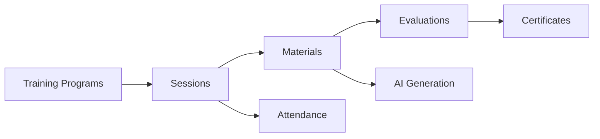

## Overview

The Training module provides a complete learning management system (LMS) for pharmacovigilance staff, including course creation, session management, attendance tracking, AI-powered content generation, and automated certificate issuance.

## Architecture

<Diagram>

</Diagram>

## Course Structure

### Programs (Programas)

Top-level training programs with metadata:

```python Program Model
class CapPrograma:
    id: UUID
    titulo: str  # "Inducción Farmacovigilancia 2025"
    descripcion: str
    fecha_inicio: date
    fecha_fin: date
    responsable_id: int  # Employee responsible
    estado: str  # "vigente" | "finalizado" | "borrador"
    obligatorio: bool  # Mandatory for all staff
```

### Sessions (Sesiones)

Scheduled training sessions within a program:

```python Session Model (backend/app/routers/capacitacion.py:275)
class CapSesion:
    id: UUID
    programa_id: UUID
    titulo: str  # "ICSR: Registro y Validación"
    tema: str  # "ICSR", "Regulatorio", "QA"
    fecha_programada: datetime
    duracion_min: int  # 90 minutes
    modalidad: str  # "presencial" | "virtual" | "hibrida"
    instructor: str
    ubicacion: str  # "Sala 201" or "Zoom link"
    max_participantes: int
    mes_programado: int  # 1-12, for matrix view
```

<Tip>
Use `mes_programado` (1-12) to organize sessions in the annual calendar matrix view.
</Tip>

### Materials (Materiales)

Training content with AI generation capabilities:

```python Material Model (backend/app/models/capacitacion.py)
class CapMaterial:
    id: UUID
    titulo: str
    descripcion: str
    tipo: str  # "archivo" | "enlace"
    categoria: str  # "Obligatorio" | "Procedimientos" | "Referencias"
    
    # File/link
    url: Optional[str]  # S3/local path or external URL
    video_url: Optional[str]
    image_url: Optional[str]  # Thumbnail
    
    # AI generation
    generation_mode: str  # "manual" | "full_auto" | "ai_from_material"
    auto_full_params: Optional[dict]  # JSON with AI prompts
    
    # Quiz/evaluation
    quiz_json: Optional[dict]  # Questions with answers
    quiz_lock_at: Optional[datetime]  # Deadline
    min_score: Optional[int]  # Passing score (out of 20)
    max_attempts: Optional[int]  # Default: 3
    
    # Visibility
    audience_mode: str  # "todos" | "areas" | "personalizado"
    audience_areas: Optional[list]  # ["FV", "QA", "Regulatorio"]
    audience_ids: Optional[list[int]]  # Specific employee IDs
    
    # Scheduling
    programa_id: Optional[UUID]
    sesion_id: Optional[UUID]
    tema: Optional[str]
    mes_programado: Optional[int]  # 1-12
```

## AI-Powered Content Generation

### Full Auto Mode

Generate complete training materials with a single prompt:

```python Full Auto Material Creation (POST /api/v1/capacitacion/materiales)
{
  "titulo": "Introducción a Farmacovigilancia",
  "generation_mode": "full_auto",
  "auto_full_params": {
    "descripcion": "Conceptos básicos, marco regulatorio peruano, flujo VIGIA",
    "objetivos": "Al finalizar, el participante podrá identificar eventos adversos y completar ICSRs",
    "publico": "Personal nuevo de áreas clínicas y QA",
    "duracion": "90 minutos",
    "extras": "Incluir ejemplos de casos reales del sector salud peruano",
    "quiz_num_questions": 10,
    "quiz_types": ["single_choice", "multiple_choice", "true_false"]
  },
  "min_score": 14,  # 14/20 to pass
  "max_attempts": 3
}
```

**What Gets Generated:**

<Steps>
  <Step title="Material Content">
    3+ pages of structured text with:
    - Introduction and objectives
    - Main content with sections and subsections
    - Practical examples with moderate emoji use (💊, ⚠️, ✅)
    - Bibliography section (APA format)
  </Step>
  
  <Step title="PDF Document">
    Professional PDF with:
    - Cover page with title and metadata
    - Multiple pages with 11pt Helvetica font
    - Automatic page breaks
    - Margins: 40px (left/right), 50px (top/bottom)
  </Step>
  
  <Step title="Quiz/Evaluation">
    10 questions (configurable) with:
    - Mixed question types
    - Point distribution (total: 20)
    - Correct answers marked
    - Explanations for open-ended questions
  </Step>
  
  <Step title="Metadata">
    Context stored in `quiz_json.meta`:
    - Description, objectives, audience, duration
    - `context_lines` for certificate generation
  </Step>
</Steps>

<Warning>
Full auto generation requires OpenAI API access. Model must support structured output (gpt-4o, gpt-4.1, etc.).
</Warning>

### AI-Assisted Quiz Generation

Generate evaluations from existing materials:

```python Generate Quiz from Text (POST /api/v1/capacitacion/quiz/generate)
{
  "material_text": "Farmacovigilancia es la ciencia que estudia...",
  "num_questions": 8,
  "question_types": [
    "single_choice",
    "multiple_choice",
    "true_false",
    "short_text"
  ]
}

# Response:
{
  "questions": [
    {
      "id": "q1",
      "type": "single_choice",
      "text": "¿Qué significa ICSR?",
      "points": 3,
      "options": [
        {"id": "o1", "text": "Informe de Seguridad Individual de Caso", "correct": true},
        {"id": "o2", "text": "Índice Clínico de Señales y Riesgos", "correct": false},
        {"id": "o3", "text": "Inspección de Calidad sobre Reacciones", "correct": false}
      ]
    },
    {
      "id": "q2",
      "type": "multiple_choice",
      "text": "Selecciona los pasos del flujo VIGIA:",
      "points": 2,
      "options": [
        {"id": "o1", "text": "Ingesta multicanal", "correct": true},
        {"id": "o2", "text": "Evaluación de causalidad", "correct": true},
        {"id": "o3", "text": "Reporte IPS/ICSR", "correct": true},
        {"id": "o4", "text": "Auditoría y trazabilidad", "correct": true}
      ]
    }
  ],
  "total_points": 20
}
```

**Supported Question Types:**

| Type | Description | Answer Format |
|------|-------------|---------------|
| `single_choice` | One correct option | `options[].correct: bool` |
| `multiple_choice` | Multiple correct options | `options[].correct: bool` (≥2) |
| `true_false` | Boolean question | `answer: bool` |
| `short_text` | Brief open response | `explanation: str` (guidance) |
| `long_text` | Paragraph response | `explanation: str` (rubric) |
| `image_select` | Visual identification | `options[].correct: bool` |
| `ordering` | Sequence arrangement | `correct_order: ["id1", "id2", ...]` |
| `matching` | Pair matching | `pairs: [{left, right}, ...]` |

<Note>
The system automatically distributes 20 total points across questions. For 10 questions: each gets 2 points. For 8 questions: 6 get 2 points, 2 get 3 points.
</Note>

## Attendance Management

Track participant attendance for sessions:

```python Register Attendance (POST /api/v1/capacitacion/asistencia)
{
  "sesion_id": "<uuid>",
  "empleado_id": 42,
  "estado": "presente",  # "presente" | "ausente" | "tardanza"
  "observaciones": "Llegó 10 minutos tarde"
}

# Bulk registration
{
  "sesion_id": "<uuid>",
  "asistencias": [
    {"empleado_id": 42, "estado": "presente"},
    {"empleado_id": 43, "estado": "ausente"},
    {"empleado_id": 44, "estado": "presente"}
  ]
}
```

### Attendance Report

```python Get Session Attendance (GET /api/v1/capacitacion/sesiones/{id}/asistencia)
{
  "sesion": {
    "titulo": "ICSR: Registro y Validación",
    "fecha_programada": "2025-03-15T14:00:00Z"
  },
  "total_registrados": 25,
  "presentes": 23,
  "ausentes": 2,
  "tardanzas": 1,
  "tasa_asistencia": 0.92,
  "detalles": [
    {
      "empleado": {"id": 42, "nombre": "María García"},
      "estado": "presente",
      "hora_registro": "2025-03-15T14:05:00Z"
    }
  ]
}
```

## Certificate Generation

Automatic certificate generation upon course completion:

### Certificate Criteria

<Check>
**Criteria for Certificate Issuance:**
- ✅ Completed all required materials
- ✅ Passed all evaluations (score ≥ `min_score`)
- ✅ Attendance ≥ 80% for sessions marked as `obligatorio`
- ✅ Submitted within deadline (if `quiz_lock_at` set)
</Check>

### Certificate Template

```python Certificate Data Structure
{
  "empleado": {
    "nombre_completo": "María Fernanda García López",
    "documento": "12345678",
    "area": "Farmacovigilancia"
  },
  "programa": {
    "titulo": "Inducción a Farmacovigilancia 2025",
    "duracion_total_horas": 12,
    "fecha_inicio": "2025-01-15",
    "fecha_fin": "2025-03-15"
  },
  "calificaciones": {
    "promedio": 17.5,  # Out of 20
    "nota_minima": 14,
    "aprobado": true
  },
  "fecha_emision": "2025-03-16",
  "codigo_verificacion": "VIGIA-2025-FV-001234",
  "firmante": {
    "nombre": "Dr. Carlos Rodríguez",
    "cargo": "Responsable de Farmacovigilancia",
    "firma_digital": "<base64_signature>"
  }
}
```

<Tip>
Certificates include a QR code with verification URL: `https://vigia.example.com/verify/{codigo_verificacion}`
</Tip>

## Material Visibility & Access Control

### Audience Modes

<Tabs>
  <Tab title="Todos">
    Visible to all employees across all areas.
    
    ```python
    {
      "audience_mode": "todos",
      "audience_areas": null,
      "audience_ids": null
    }
    ```
  </Tab>
  
  <Tab title="Áreas">
    Restricted to specific organizational areas.
    
    ```python
    {
      "audience_mode": "areas",
      "audience_areas": ["FV", "QA", "Regulatorio"],
      "audience_ids": null
    }
    ```
  </Tab>
  
  <Tab title="Personalizado">
    Visible only to specific employees.
    
    ```python
    {
      "audience_mode": "personalizado",
      "audience_areas": null,
      "audience_ids": [42, 43, 44, 45]
    }
    ```
  </Tab>
</Tabs>

<Warning>
Legacy values (`privado`, `interno`, `publico`) are automatically normalized to new format (`personalizado`, `areas`, `todos`).
</Warning>

## Progress Tracking

### Employee Progress

```python Get Training Progress (GET /api/v1/capacitacion/progress/{empleado_id})
{
  "empleado_id": 42,
  "programas_activos": [
    {
      "programa_id": "<uuid>",
      "titulo": "Inducción Farmacovigilancia 2025",
      "progreso": {
        "materiales_completados": 8,
        "materiales_totales": 10,
        "porcentaje": 80,
        "evaluaciones_aprobadas": 7,
        "evaluaciones_totales": 8,
        "promedio_calificaciones": 16.2,
        "asistencia_sesiones": 0.92
      },
      "proximo_vencimiento": {
        "material": "Evaluación Final",
        "fecha_limite": "2025-03-20T23:59:59Z",
        "dias_restantes": 5
      }
    }
  ],
  "certificados_obtenidos": [
    {
      "programa": "ICSR Avanzado 2024",
      "fecha_emision": "2024-12-15",
      "calificacion": 18.5,
      "codigo_verificacion": "VIGIA-2024-FV-000987",
      "url_descarga": "/api/v1/capacitacion/certificados/000987.pdf"
    }
  ]
}
```

### Course Analytics

```python Program Statistics (GET /api/v1/capacitacion/programas/{id}/stats)
{
  "programa_id": "<uuid>",
  "titulo": "Inducción Farmacovigilancia 2025",
  "estadisticas": {
    "participantes_inscritos": 45,
    "participantes_activos": 42,
    "completado": 28,
    "en_progreso": 14,
    "abandonado": 3,
    "tasa_completacion": 0.62,
    "promedio_calificaciones": 16.8,
    "tiempo_promedio_horas": 14.5
  },
  "materiales_mas_dificiles": [
    {
      "titulo": "Evaluación Causalidad",
      "promedio_intentos": 2.3,
      "promedio_calificacion": 13.2,
      "tasa_aprobacion": 0.71
    }
  ],
  "asistencia_por_sesion": [
    {
      "sesion": "Introducción",
      "tasa_asistencia": 0.96
    },
    {
      "sesion": "Práctica ICSR",
      "tasa_asistencia": 0.89
    }
  ]
}
```

## API Configuration

### OpenAI Settings

```bash AI Generation Configuration
OPENAI_MODEL_EXTRACT="gpt-4o-mini"  # Default model
OPENAI_TIMEOUT_SEC="65"  # Request timeout
OPENAI_MAX_RETRIES="2"

# Temperature control
# Note: gpt-5 models do NOT accept temperature parameter
# System automatically detects and skips for incompatible models
```

<Warning>
Models in the `NO_TEMPERATURE_MODELS` set (gpt-5, gpt-5.1, gpt-5.1-mini) will have temperature parameter stripped to prevent API errors.
</Warning>

## Best Practices

<CardGroup cols={2}>
  <Card title="Content Design" icon="pen-to-square">
    - Use full_auto mode for consistent formatting
    - Provide detailed `objetivos` for focused content
    - Specify `publico` to tailor complexity level
    - Request 60-90 minute sessions (optimal engagement)
    - Include real-world examples in `extras` field
  </Card>
  
  <Card title="Quiz Design" icon="list-check">
    - Mix question types for variety
    - Use 8-12 questions per evaluation
    - Set `min_score` to 14/20 (70% pass rate)
    - Allow 3 attempts for learning reinforcement
    - Provide explanations for open-ended questions
  </Card>
  
  <Card title="Session Planning" icon="calendar">
    - Schedule sessions 2+ weeks in advance
    - Use `mes_programado` for annual planning
    - Link materials to sessions with `sesion_id`
    - Set `max_participantes` for venue capacity
    - Send reminders 48h before session
  </Card>
  
  <Card title="Access Control" icon="lock">
    - Use `audience_mode="areas"` for role-based access
    - Restrict sensitive materials with `personalizado`
    - Mark compliance training as `obligatorio=true`
    - Set `quiz_lock_at` for deadline enforcement
    - Review access logs in audit trail
  </Card>
</CardGroup>

## Troubleshooting

<AccordionGroup>
  <Accordion title="AI Generation Timeout" icon="clock">
    **Symptoms:** API returns 504 Gateway Timeout
    
    **Causes:**
    - Model overload (OpenAI service issues)
    - Content too long (>20,000 chars)
    - Slow network connection
    
    **Solutions:**
    - Increase `OPENAI_TIMEOUT_SEC` to 90
    - Reduce `auto_full_params.extras` length
    - Use smaller model (gpt-4o-mini)
    - Retry after 2-3 minutes
  </Accordion>
  
  <Accordion title="Certificate Not Generated" icon="award">
    **Checklist:**
    - [ ] All required materials marked as completed?
    - [ ] All quiz scores ≥ `min_score`?
    - [ ] Attendance ≥ 80% if program is `obligatorio`?
    - [ ] Submission before `quiz_lock_at` deadline?
    - [ ] Program status is `vigente` (not `borrador`)?
    
    **Debug:**
    ```python
    GET /api/v1/capacitacion/certificados/check/{empleado_id}/{programa_id}
    # Returns missing requirements
    ```
  </Accordion>
  
  <Accordion title="Quiz Points Don't Sum to 20" icon="calculator">
    **Cause:** Manual quiz JSON editing
    
    **Fix:** Call redistribution endpoint
    ```python
    POST /api/v1/capacitacion/materiales/{id}/redistribute-points
    # Automatically recalculates and saves
    ```
  </Accordion>
</AccordionGroup>

## Related Documentation

<CardGroup cols={2}>
  <Card title="Employee Management" icon="users" href="/essentials/rrhh">
    Managing staff records and organizational areas
  </Card>
  <Card title="Audit Trail" icon="clock-rotate-left" href="/modules/audit-trail">
    Tracking training completion and certificate issuance
  </Card>
</CardGroup>